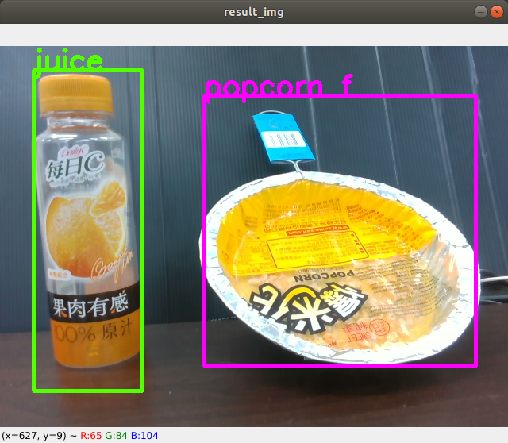
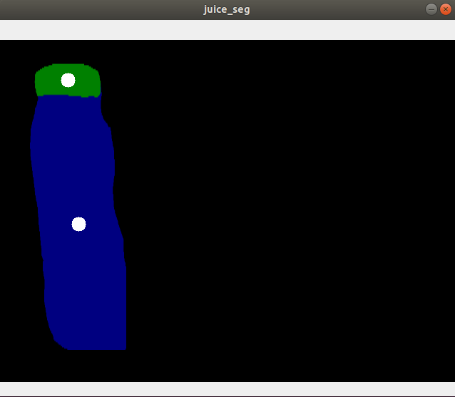
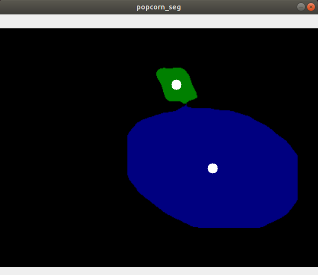
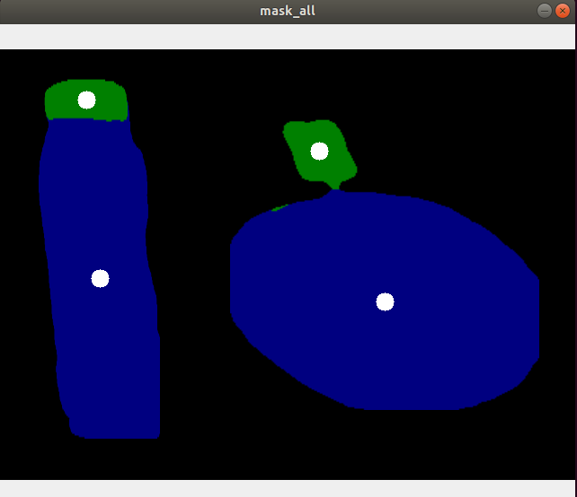

download weighting for YOLOv4
https://drive.google.com/drive/folders/1dlr5jqBtIn0p6nySPJwbV-puL-CtW10m?usp=sharing
put files in folder
<workspace>/src/affordance_ros/part_detection/weights/20210806/

#YOLOv4
chomod +x demo_d435i.py

. devel/setup.bash
roslaunch part_detection part_detection.launch

#DeepLab v3 Plus
chomod +x juice_seg.py
chomod +x popcorn_seg.py
chomod +x show_seg_all.py

. devel/setup.bash
rosrun part_sematic_seg juice_seg.py
rosrun part_sematic_seg popcorn_seg.py
rosrun part_sematic_seg show_seg_all.py

### 1. 部件分割 affordance_ros
   + (1) `part_detection: YOLOv4, YOLOv4-tiny` 
    - popcorn_f, popcorn_b, juice    
    
    part_detection_result

   + (2) `part_sematic_seg: DeepLab v3 Plus` 
    - plant, handle, cap, body
        
    
     
    part_sematic_seg(juice)
    part_sematic_seg(popcorn)
    part_sematic_seg(juice,popcorn)